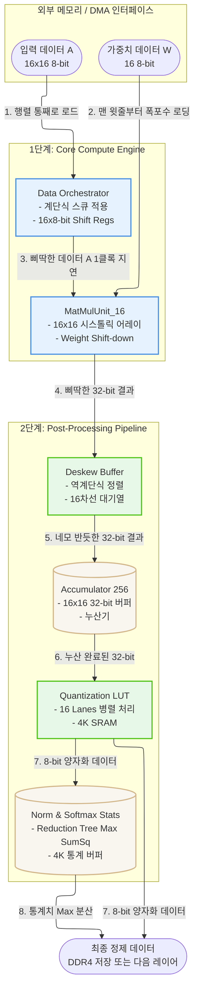

## 🧠 전체 하드웨어 아키텍처 (TPU Pipeline)

본 프로젝트의 시스톨릭 어레이 및 후처리 파이프라인 데이터 흐름도입니다.

```mermaid
---
config:
  layout: elk
---
graph TD
    classDef memory fill:#f9f6f0,stroke:#d3b88c,stroke-width:2px,color:#333
    classDef compute fill:#e6f3ff,stroke:#4a90e2,stroke-width:2px,color:#333
    classDef post fill:#e8f8e8,stroke:#52c41a,stroke-width:2px,color:#333

    subgraph External[외부 메모리 / DMA 인터페이스]
        InputA([입력 데이터 A<br/>16x16 8-bit])
        InputW([가중치 데이터 W<br/>16 8-bit])
    end

    subgraph CoreEngine[1단계: Core Compute Engine]
        Orch[Data Orchestrator<br/>- 계단식 스큐 적용<br/>- 16x8-bit Shift Regs]:::compute
        SysArray[MatMulUnit_16<br/>- 16x16 시스톨릭 어레이<br/>- Weight Shift-down]:::compute
    end

    subgraph PostProcessor[2단계: Post-Processing Pipeline]
        Deskew[Deskew Buffer<br/>- 역계단식 정렬<br/>- 16차선 대기열]:::post
        Acc[(Accumulator 256<br/>- 16x16 32-bit 버퍼<br/>- 누산기)]:::memory
        Quant[Quantization LUT<br/>- 16 Lanes 병렬 처리<br/>- 4K SRAM]:::post
        Stats[(Norm & Softmax Stats<br/>- Reduction Tree Max SumSq<br/>- 4K 통계 버퍼)]:::memory
    end

    Output([최종 정제 데이터<br/>DDR4 저장 또는 다음 레이어])

    InputA -->|1. 행렬 통째로 로드| Orch
    InputW -->|2. 맨 윗줄부터 폭포수 로딩| SysArray
    Orch -->|3. 삐딱한 데이터 A 1클록 지연| SysArray
    SysArray -->|4. 삐딱한 32-bit 결과| Deskew
    Deskew -->|5. 네모 반듯한 32-bit 결과| Acc
    Acc -->|6. 누산 완료된 32-bit| Quant
    Quant -->|7. 8-bit 양자화 데이터| Stats
    Quant -->|7. 8-bit 양자화 데이터| Output
    Stats -->|8. 통계치 Max 분산| Output
```
